# :pizza: Прогрев Додо Пиццы

Проект по курсу "Инженерия данных и ETL"
[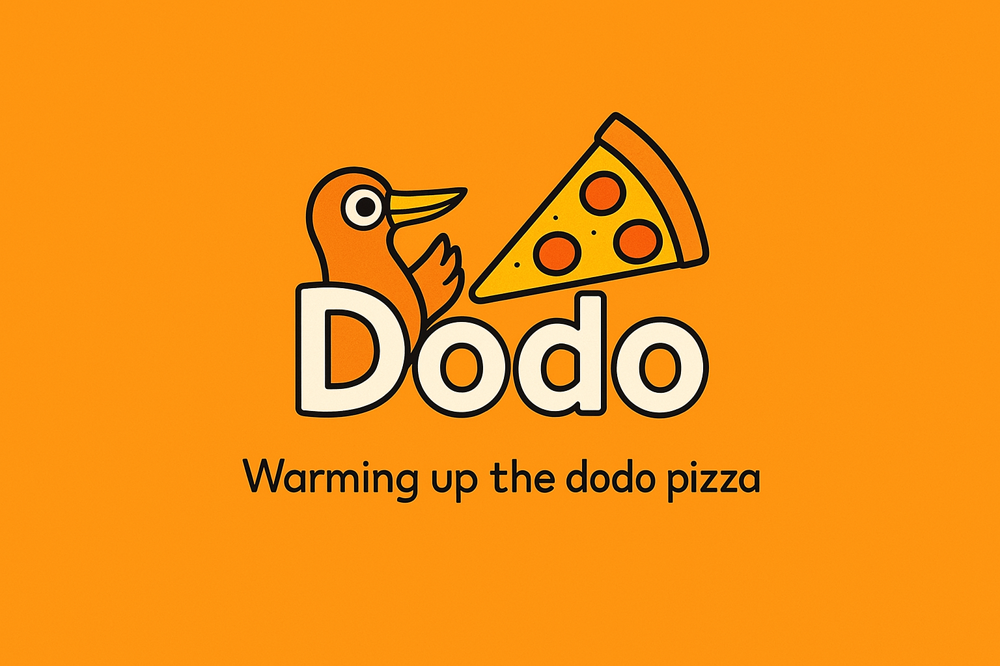](https://find-combo.ru/)

## Постановка задачи

Наверняка каждый из вас слышал об известной сети ресторанов быстрого питания "Додо Пицца", а возможно даже делал заказ для себя или большой компании друзей. И, изучая ассортимент,     замечали, что помимо основного меню Додо предлагает различные комбо из товаров по более выгодной цене. А задумывались ли вы о том, сколько платите за заказ и можно ли скомбинировать товары так, чтобы потратить меньше?

Задачей проекта стала реализация программы, которая бы помогла покупателю распределять товары по комбо таким образом, чтобы итоговая сумма покупок была минимальной.

Оказалось, что не всегда очевидное на первый взгляд решение окажется правильным.

## Поиск источников данных

Основным источником данных стал сайт ["Додо Пицца"](https://dodopizza.ru/moscow/tsaritsyno)

При первичном анализе источника было выявлено, что компания не предоставляет меню в одном или нескольких файлах типа json, например, и все данные можно собрать только из html страниц. Причем, оказалось, что каждая позиция имеет свою отдельную страницу, и каждая такая страница динамическая (при изменении размера пиццы меняется только некоторые данные в наполнении но не сам код). *О том, как была решена данная задача будет рассказано в следующем разделе*

Помимо этого рассматривались также иные способы выгрузки данных. Основной целью был поиск полноценного меню, собранного в одном месте:

1. Так как Додо работает по франшизе, мы решили обратиться к открытому [API](https://docs.dodois.io/?ysclid=m91nv3uzd4818545806). На первый взгляд страница предоставляет всю информацию о компании, включая оценки пользователей или расписание сотрудников. Однако, сайт не обращается к данному API при загрузке меню в явном виде. Вероятнее всего о имеет свой внутренний backend. 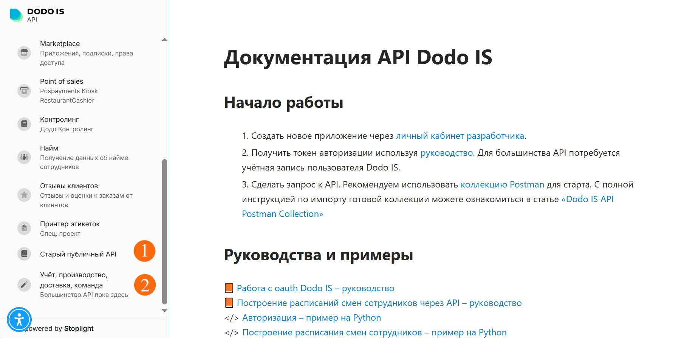
2. Также мы проверили возможность выгрузки меню из данных о ресторанах на картах. Но они также обращаются у самому сайту Додо, а состав комбо можно увидеть только перейдя на страницу компании.

После проверки всех источников мы вернулись к первому варианту и приняли решение получать данные из html страниц.

## Анализ источников данных

Как уже было отмечено в предыдущем разделе, данные о каждой позиции товара хранятся в виде отдельной страницы. Например, при первой загрузке сайта в ссылке отражается только город и выбранный район.

><https://dodopizza.ru/moscow/tsaritsyno>

А при выборе какого-то товара ссылка проваливается вглубь.

><https://dodopizza.ru/moscow/tsaritsyno/product/chill-grill-pizza>

Причем все позиции в меню проходят через раздел product. Но вот на нее саму попасть нельзя.

На главной странице можно получить названия товаров из основного меню и комбо. Но цену можно узнать только у некоторых, так называемых, не редактируемых товаров, то есть у позиций, которые не имеют вариаций по размеру, объему или наполнению. Такие товары сразу можно добавить "в корзину". У редактируемых товаров можно узнать только цену за товар наименьшего размера, например, у пиццы указывается цена за диаметр 25 см. Для того чтобы узнать другие характеристики позиции нужно перейти непосредственно на страницу товара.

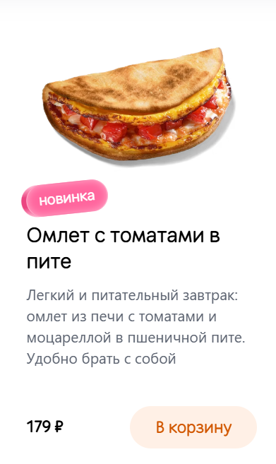 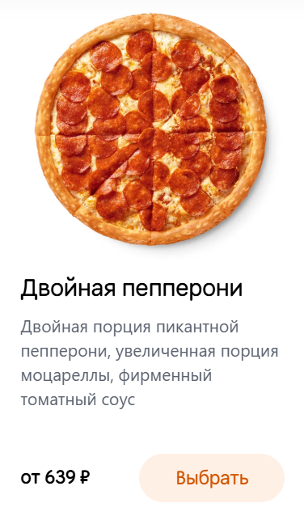

Чтобы получить все данные из редактируемых товаров нужно не только открыть страницу позиции, но и переключиться между всеми возможными вариациями. При неизменном адресе страницы ее содержание будет изменяться, в частности цена.

Для получения состава комбо также необходимо открыть страницу каждого из них. Все слоты из комбо имеют возможность замены входящего в него товара. То есть, для того, чтобы узнать вариации позиций в слоте, нужно отдельно просмотреть каждый.

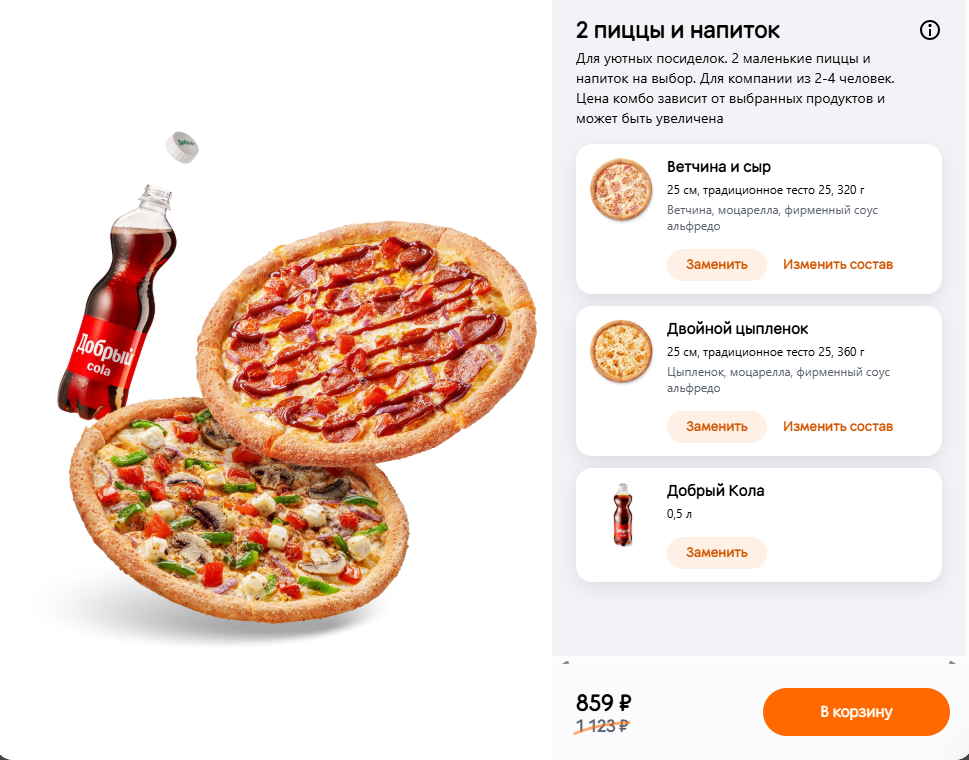 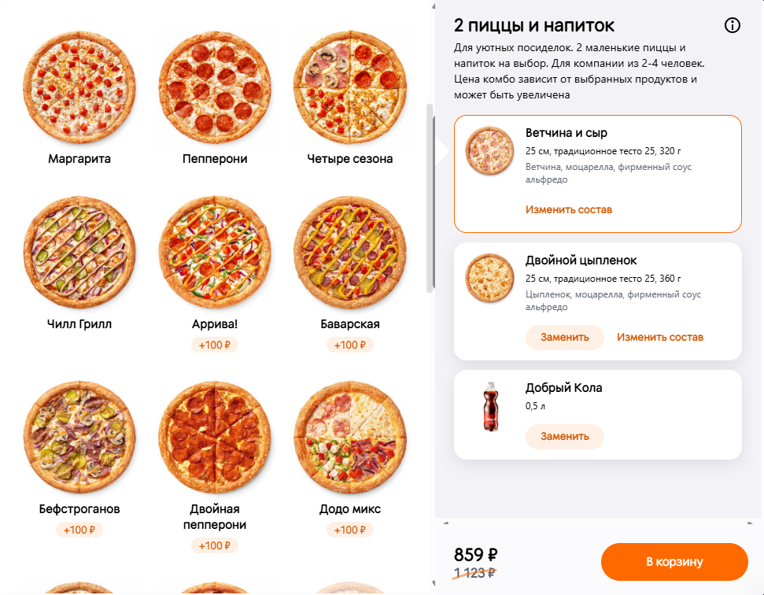

Причем в слот могут входить как редактируемые, так и не редактируемые товары. И из названия или описания комбо не всегда сразу понятно какой размер редактируемого товара можно включить. Например, сразу виден диаметр пиццы, а вот размер порции картофеля можно узнать только кликнув на эту позицию.

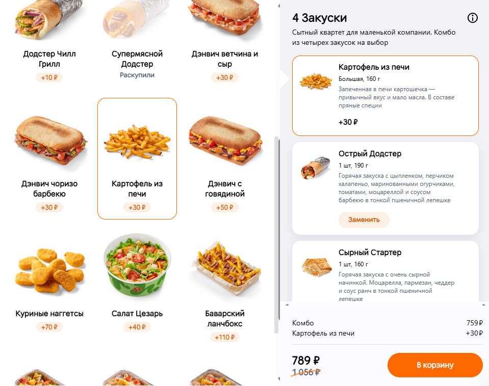

Однако есть слоты, которые помимо вариации товара имеют возможность редактировать его объем. Это также необходимо проверить и считать эти данные.

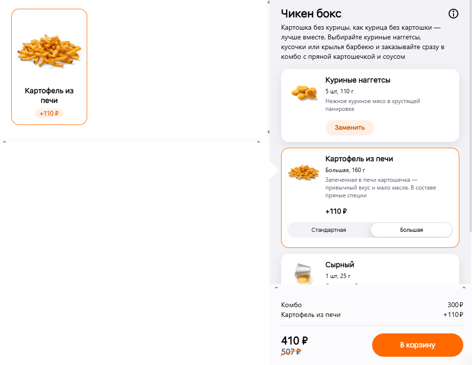

Необходимо просматривать все вариации товаров, так как они имеют разные наценки. Причем у не редактируемых товаров и пиццы значения наценок можно будет считать после нажатия выбора вариации слота.

## Первичный анализ данных

После того, как мы рассмотрели в каком виде хранятся товары, нужно определить какие разделы необходимо выгрузить. На главной странице представлены следующие категории:

- Пиццы
- Комбо
- Закуски
- Коктейли
- Кофе
- Напитки
- Десерты
- Соусы
- Другие товары
- Новинки
- Завтрак
- Хиты
- На компанию
- Любят дети

На первый взгляд достаточно много разделов. Однако, нужная информация находится в первых восьми. Все оставшиеся либо содержат повторы основных, либо включают несъедобные дополнительные позиции: салфетки, игрушки и прочее. В данной задаче они нас не интересуют.

Товары из этих 8 разделов нужно разделить на 2 категории: основное меню и комбо. Проанализировав, все что находится на странице, мы отметили, что помимо раздела "Комбо" во вторую категорию еще будут отнесены позиции из закусок и десертов, включающие в себя мини комбинации других товаров.

>Например, интересно рассмотреть следующие позиции:
>- картофель из печи c соусом, стандартный - 180 руб
>- 2 соуса - 75 руб
>- картофель из печи, стандартный - 149 руб
>- соус - 49 руб  
>1. При выборе одного картофеля и одного соуса выгоднее взять набор за 180 руб, чем заплатить 149 + 49 = 198 руб, выбрав товары по отдельности.  
>2. А вот с картофелем и двумя соусами уже менее очевидно. Если взять набор и дополнительно соус выйдет: 180 + 49 = 229 руб. Но не всегда сразу заметно, что выгоднее взять отдельно картофель и комбо из 2 соусов и заплатить 149 + 75 = 224 руб, что меньше изначального варианта на 5 руб.

Поэтому все не одиночные товары сразу переместим в категорию "Комбо"

Определи, какие товары куда будем загружать перейдем непосредственно к парсингу.

## Выгрузка данных из источников

> **Важно!** При парсинге данных рассматривался определенный ресторан Додо, то есть задавался конкретный адрес с указанием города и улицы. Даже в одном городе цены на товары отличаются и нет определенной очевидной зависимости их изменения. При смене ресторана необходимо заново собирать данные, изменяя адрес в ссылке.

Подключим все необходимые библиотеки и создадим объект через который будет происходить работа с браузером:

```python
from bs4 import BeautifulSoup # парсинг html документов
from selenium import webdriver # автоматизация действий в браузере, модуль для управления браузером
from selenium.webdriver.common.by import By # автоматизация действий в браузере, используется для указания способа поиска элементов по странице
import time # библиотека для работы со временем
import re # работа с регулярными выражениями, извлечение необходимых данных
from tqdm import tqdm # создание прогресс баров
import pickle # сохранение данных в файл
import json # работа с данными в формате json

driver = webdriver.Chrome()
```

Приступим к работе с сайтом.

### Парсинг основного меню

Для начала необходимо открыть в браузере главную страницу выбранной пиццерии (в URL  указать город и адрес), получить код html страницы  создать объект для парсинга html.

```python
driver.get(f'https://dodopizza.ru/{city}/{address}')
src = driver.page_source
soup = BeautifulSoup(src, 'lxml')
 ```

На странице находим находим расположение информации о всех комбо, а также коды других категорий.

```python
products = soup.find('main', class_='sc-dd7wua-1 sc-1tj5y7k-1 ejwPVd hLWBmH')
combos = products.find('section', id='nkank').find_all(class_='sc-1gfzx1o-4 IvuLK')
section_ids = ('guzhy', 'kxgls', 'mrwqq', 'dtgyl', 'zzvck', 'uzlth', 'auyfy')
```

После готовим списки, куда будем собирать всю необходимую информацию о товарах.
1. items_info - общий список, куда сразу идут все нередактируемые товары
2. items_check - список для редактируемых товаров, у которых нужно посмотреть вариации перед тем, как добавлять их в items_info

При этом заметим, что некоторые товары на сайте имеют значки emoji, которые показывают, что товар подходит для детей, вегетарианцев или он острый. Их необходимо также исключить из считываемых названий.

```python
emoji_pattern = re.compile("["
        u"\U0001F600-\U0001F64F"  # emoticons
        u"\U0001F300-\U0001F5FF"  # symbols & pictographs
        u"\U0001F680-\U0001F6FF"  # transport & map symbols
        u"\U0001F1E0-\U0001F1FF"  # flags (iOS)
                           "]+", flags=re.UNICODE)


items_info = len(section_ids) * [None]
items_check = len(section_ids) * [None]
```

Теперь получим информацию о товарах. Для каждой из 7 категорий, не включая комбо, из кода html получим ее название и количество содержащихся в ней товаров. После из каждой категории выгрузим название всех входящих нее позиций, параллельно удаляя emoji.

После последовательно анализируя вид цены товара распределяем его либо в список позиций с фиксированными ценами, либо в список товаров, имеющих вариации.

```python
button_num = 1

for i, section_id in enumerate(section_ids):
    items_section = products.find('section', id=section_id)

    section_title = items_section.find('h2', class_='sc-1tj5y7k-0 eVvGfE').get_text().rstrip()

    items_info[i] = {'title': section_title, 'items': []}
    items_check[i] = {'title': section_title, 'items': []}

    items = items_section.find_all(class_='sc-1gfzx1o-4 IvuLK')
    print(items_info[i]['title'], len(items), sep=' - ')

    # учитываем пропуск раздела комбо
    if i == 1: button_num += len(combos)

    for item in items:
        item_title_info = item.find(class_='sc-1gfzx1o-2 gCRxXk')
        item_title = emoji_pattern.sub(r'', item_title_info.get_text()).rstrip()
        if item_title == 'Пицца из половинок': continue
        print(items_info[i]['title'], item_title, sep=', ')

        item_price_info = item.find(class_='product-control-price')
        item_price_text = item_price_info.get_text()

        # проверка на наличие вариаций у товара
        editable = True if item_price_text.startswith('от ') else False

        item_price_text = re.search(r'([\d\s]+)₽', item_price_text).group(1).rstrip()
        item_price_int = int(item_price_text)
        print(items_info[i]['title'], item_price_int, editable, sep=', ')

        # проверка на комбо по двойному ценнику
        if item.find(class_='product-control-oldprice'):
            continue

        if not editable:
            items_info[i]['items'].append(
                {'title': item_title,
                 'price': item_price_int}
            )
        else:
            items_check[i]['items'].append(
                {'title': item_title,
                 'button_num': button_num}
            )
            button_num += 1
```

Теперь необходимо собрать информацию о редактируемых товарах. Прокликиваем все страницы товаров, имеющих вариации. С помощью средств библиотеки selenium имитируем проход по странице товара. Собираем информацию о размере и цене каждой выбранной вариации.

```python
for section in items_check:
    for i, item in tqdm(enumerate(section['items']), total=len(section['items']), desc=f'{section["title"]}'):

        item['variations'] = []

        button_num = item['button_num']

        entry = driver.find_element(By.XPATH, f'(//button[normalize-space()="Выбрать"])[{button_num}]')
        driver.execute_script('arguments[0].scrollIntoView({block: "center"});', entry)
        driver.execute_script("arguments[0].click();", entry)

        src = driver.page_source
        soup = BeautifulSoup(src, 'lxml')

        time.sleep(1)
        variations = soup.find('div', class_='sc-1rpjq4r-0 FwDxs')
        variations_names = [variation.get_text() for variation in variations.find_all(class_='sc-1rpjq4r-2 fkoocK')]

        item['variations'] = len(variations_names) * [None]

        # смотрим выбранную по умолчанию вариацию
        variation_choice = variations.find('div', class_='sc-1rpjq4r-1 jdUKb').get('style')
        match = re.search(r'translateX\(calc\((\d+%)\)\)', variation_choice)
        variation_calc = int(match.group(1)[:-1])

        variation_1st_id = variation_calc // 100
        variation_ids = [variation_1st_id]
        for j in range(len(variations_names)):
            if j == variation_1st_id: continue
            variation_ids.append(j)

        for variation_id, variation_name in zip(variation_ids,
                                                [variations_names[variation_id_] for variation_id_ in variation_ids]):
            if variation_id != variation_1st_id:
                entry = driver.find_element(By.XPATH, f"//label[contains(text(), '{variation_name}')]")
                driver.execute_script("arguments[0].click();", entry)

                src = driver.page_source
                soup = BeautifulSoup(src, 'lxml')

            variation_info = soup.find('div', class_='sc-1r4m23d-18 jzQnfx')
            variation_price_text = variation_info.find('span', class_='money__value').get_text()
            variation_price_int = int(variation_price_text.replace('\xa0', ''))

            item['variations'][variation_id] = {
                'name': variation_name,
                'price': variation_price_int
            }

        entry = driver.find_element(By.XPATH, f'//button[contains(@class, "popup-close-button")]')
        driver.execute_script("arguments[0].click();", entry)
        time.sleep(1)
```

Чтобы завершить парсинг основного меню необходимо объединить оба массива с редактируемыми и не редактируемыми товарами, параллельно проверяя и устраняя дубликаты в списках.

```python
for section1, section2 in zip(items_info, items_check):
    for item in section2['items']:
        if not 'variations' in item:
            continue
        for item_variation in item['variations']:
            section1['items'].append(
                {'title': item['title'] + ', ' + item_variation['name'],
                 'price': item_variation['price']}
            )
```


### Парсинг страницы комбо

Для парсинга составляющих комбо также сначала подготавливаем массивы куда будем собирать информацию и сохраняем названия и цены комбо. Аналогично предыдущему случаю убираем все ненужные символы, например, обозначение валюты - Р.

```python
combos_info = []
for combo in combos:
    combo_title_info = combo.find(class_='sc-1gfzx1o-2 gCRxXk')

    combo_price_info = combo.find(class_='product-control-price')
    combo_price_text = combo_price_info.get_text()
    combo_price_text = re.search(r'([\d\s]+)₽', combo_price_text).group(1).rstrip()
    combo_price_int = int(combo_price_text.replace('\xa0', ''))

    combos_info.append(
        {'title': combo_title_info.get_text().rstrip(),
         'price': combo_price_int}
    )
```

Осталось собрать информацию о составляющих слотов. Для этого также настраиваем автоматическую работу с браузером и в каждом комбо проверяем наличие кнопки "Заменить". Для каждой из них нужно перейти вглубь и считать всю имеющуюся информацию. В массив сохраняем все вариации товаров в комбо и их возможные наценки. Плюс, для редактируемых товаров проверяем возможность изменения диаметра или объема. Все названия записываем аналогично основному меню, включая в них данные о размере.

```python
combo_button_start = items_check[0]['items'][-1]['button_num'] + 1      # для отсчета кнопок 'Выбрать' у комбо

def get_extra_price(select_item):
    item_extra_price = select_item.find(class_='sc-qlzmyl-0 kUslRi extra-price')
    if item_extra_price:
        item_extra_price_text = item_extra_price.get_text().split()[0][1:]
        item_extra_price_int = int(item_extra_price_text)
    else:
        item_extra_price_int = 0

    return item_extra_price_int

def add_item_to_combo_slot(combo, item_title, item_extra_price, slot_num):
    combo['items'][f'slot_{slot_num}'].append(
        {'title': item_title,
         'extra_price': item_extra_price}
    )

for j, combo in tqdm(enumerate(combos_info), total=len(combos_info), desc='Комбо'):
    combo['items'] = dict()

    entry = driver.find_element(By.XPATH, f'(//button[normalize-space()="Выбрать"])[{combo_button_start + j}]')
    driver.execute_script('arguments[0].scrollIntoView({block: "center"});', entry)
    entry.click()

    src = driver.page_source
    soup = BeautifulSoup(src, 'lxml')

    slots = soup.find_all('div', class_='sc-jokzm8-4 gSBJjd')

    slot_button_num = 1
    first_done = False

    for i, slot in enumerate(slots):
        combo['items'][f'slot_{i}'] = []

        if 'Заменить' in slot.find(class_='slot-controls').get_text():      # у слота имеется кнопка 'Заменить', чтобы выбрать товар в нем (верно практически всегда)
            entry = driver.find_element(By.XPATH, f'(//button[normalize-space()="Заменить"])[{slot_button_num}]')
            driver.execute_script('arguments[0].scrollIntoView({block: "center"});', entry)
            driver.execute_script("arguments[0].click();", entry)
            
            src = driver.page_source
            soup = BeautifulSoup(src, 'lxml')

            select_items = soup.find_all('div', class_='sc-rtif5y-4 cXBsIJ')

            is_pizza_slot = False
            for select_item in select_items:
                item_title = select_item.find('div', class_='sc-rtif5y-2 gFoYvs').get_text().rstrip()

                if not is_pizza_slot:
                    found_item = False
                    item_title_full = item_title
                    for section in items_check:     # проверяем, редактируемый ли товар путем поиска его в items_check
                        for item_gen_menu in section['items']:
                            if item_title == item_gen_menu['title']:
                                found_item = True
                                if section['title'] == 'Пиццы':     # товар оказался из раздела Пиццы, считаем, что все товары из данного слота пиццы
                                    is_pizza_slot = True
                                break
                        if found_item: break

                if found_item:      # товар оказался редактируемым, тогда тыкаем на него и смотрим его указанную вариацию
                    if not is_pizza_slot:
                        entry = driver.find_element(By.XPATH, f'//div[contains(@class, "sc-rtif5y-2 gFoYvs") and normalize-space()="{item_title}"]')
                        driver.execute_script('arguments[0].scrollIntoView({block: "center"});', entry)
                        driver.execute_script("arguments[0].click();", entry)

                        src = driver.page_source
                        soup = BeautifulSoup(src, 'lxml')

                    variations = soup.find_all('div', class_='sc-jokzm8-4 gSBJjd')[i]
                    variations_selections = variations.find('div', class_='sc-1rpjq4r-0 FwDxs variation-selector')
                    if not variations_selections or variations_selections.get_text() == 'ТрадиционноеТонкое':   # у товара нет выбора вариации, или выбор лишь 'Традиционное'/'Тонкое' для пицц
                        variation_name = variations.find('div', class_='meta-description').get_text().split(',')[0]
                        item_title_full = item_title + ', ' + variation_name

                        item_extra_price_int = get_extra_price(select_item)

                        add_item_to_combo_slot(combo, item_title_full, item_extra_price_int, i)

                    else:   # у товара есть выбор вариаций
                        for j, variation in enumerate(variations_selections.find_all('label', class_='sc-1rpjq4r-2 fkoocK')):
                            variation_name = variation.get_text()
                            item_title_full = item_title + ', ' + variation_name
                            if j == 0:
                                item_extra_price_int = get_extra_price(select_item)

                            else:
                                entry = driver.find_element(By.XPATH, f"//label[contains(text(), '{variation_name}')]")
                                driver.execute_script("arguments[0].click();", entry)

                                src = driver.page_source
                                soup = BeautifulSoup(src, 'lxml')

                                variations = soup.find_all('div', class_='sc-jokzm8-4 gSBJjd')[i]
                                item_extra_price_text = variations.find('div', class_='extraprice').get_text()
                                item_extra_price_text = re.search(r'([\d\s]+)₽', item_extra_price_text).group(1).rstrip()
                                item_extra_price_int = int(item_extra_price_text)

                            add_item_to_combo_slot(combo, item_title_full, item_extra_price_int, i)

                else:       # товар оказался нередактируемым
                    item_extra_price_int = get_extra_price(select_item)
                    add_item_to_combo_slot(combo, item_title_full, item_extra_price_int, i)
            
            if first_done: slot_button_num += 1
            else: first_done = True
        
        else:       # у слота нет кнопки 'Заменить', в нем смотрим конкретный выбранный товар
            item_title_full = slot.find('div', class_='name').get_text().rstrip()
            item_extra_price_int = 0
            add_item_to_combo_slot(combo, item_title_full, item_extra_price_int, i)

    entry = driver.find_element(By.XPATH, f'//button[contains(@class, "popup-close-button")]')
    driver.execute_script("arguments[0].click();", entry)
    time.sleep(1)
```

Все данные сохранялись в виде списков и словарей, которые удобно сохранить и просматривать в файлах типа json.

```python
with open('dodo_general_menu.json', 'w') as f:
    json.dump(items_info, f, ensure_ascii=False, indent=4)

with open('dodo_combo_menu.json', 'w') as f:
    json.dump(combos_info, f, ensure_ascii=False, indent=4)
```


Важно отметить, что все просмотры отдельных страниц происходят именно с помощью имитации нажатия кнопок. Сохранение ссылки на каждую страницу и считывание данных путем открытия этих новых ссылок работает гораздо медленнее, чем первый вариант. Это происходит, так как таким образом полностью с нуля открывается сайт Додо.

Также после сохранения всех данных некоторые позиции были перенесены из основного меню в комо вручную, так как они состоят из нескольких товаров и при совершении заказа в некоторых случаях их выбирать выгоднее.

## Сохранение данных в БД

После анализа собранных данных и сбора их в json файлы была заполнена база данных. Ниже приведено описание ее таблиц, атрибутов и связей:

1. Таблица **general_menu** описывает элементы основного меню
   - price - базовая цена товара без наценки
   - category - категория товара (пицца, напиток, закуска и т.д.)
   - title - название товара, включает в себя размер
   - id

2. Таблица **combo** - верхняя сущность всего комбо
   - price - базовая стоимость комбо без доплат
   - title - название комбо
   - id
  
3. Таблица **combo_slots** описывает возможные слоты в комбо, каждый такой слот можно заполнить одним из нескольких товаров
   - combo_id - внешний ключ родительского комбо
   - id
4. Таблица **slot_items** обеспечивает связь многие ко многим между товарами из основного меню (general_menu)и слотами комбо (combo_slots)
   - extra_price - наценки для конкретных товаров в соответствующем слоте
   - gmenu_id - внешний ключ основного меню
   - slot_id - внешний ключ слота в комбо
   - id

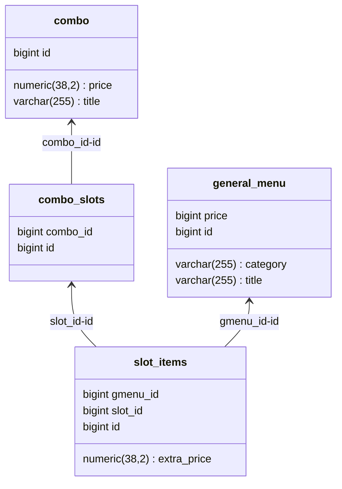

## Анализ и обработка собранных данных

На этапе парсинга и заполнения БД все полученные данные были проанализированы и распределены по таблицам удобным способом. Поэтому на этапе обработки оставалось реализовать сам алгоритм поиска оптимальной комбинации.

1. Для хранения данных во время работы программы был создан **вектор объектов Product** (использовался язык программирования С++), в которую в последствии будут занесены товары из основного меню и комбо с отдельно выделенными слотами. 
2. **Объект map**, в который записывается распределение товаров из заказа по комбо с минимально возможными ценами, то есть по мере ее заполнения будет проверяться присутствует ли данная позиция уже в карте и возможно ли уменьшить ее цену.
3. А также **структура Solution** которая будет содержать полное решение задачи со всеми распределениями, списком товаров, которые не вошли ни в одно комбо и общей стоимостью заказа.

После чего  с помощью функции **findBestCombination** находится оптимальное решение задачи. Для этого создаются все возможные комбинации комбо из полного списка продуктов и товары из заказа полным перебором распределяются по свободным слотам этого комбо с учетом возможных наценок. Не использованные комбо, то есть те, в которые не был помещен ни один товар исключаются из списка. По мере проверки всех возможных комбинаций текущая цена сравнивается с наименьшей из всех предыдущий, то есть распределение постоянно обновляется. На выходе мы получаем все заполненные слоты в комбо и товары, которые выгоднее всего купить отдельно. Код  функции, реализующий соответствующий алгоритм представлен ниже:

```c++
Solution findBestCombination(const std::vector<std::string>& requested, const std::vector<Product>& products) {
    Solution best;
    best.total_price = INT_MAX;

    auto all_items = extractAllItems(products);

    auto backtrack = [&](auto&& self, size_t prod_idx, Solution current,
                         std::vector<std::string> remaining) -> void {

        if (prod_idx == products.size()) {
            //оставшиеся товары
            for (const auto& item : remaining) {
                if (all_items.count(item)) {
                    current.individual_items.push_back(item);
                    current.total_price += all_items[item];
                } else {
                    return;
                }
            }

            if (current.total_price < best.total_price) {
                best = current;
            }
            return;
        }

        self(self, prod_idx + 1, current, remaining);
        const auto& product = products[prod_idx];
        std::vector<int> selections;
        std::vector<std::string> new_remaining = remaining;
        int extra_cost = 0;
        bool valid = true;

        //по элементу из каждого слота
        for (const auto& slot : product.first) {
            bool found = false;
            for (size_t i = 0; i < slot.size(); ++i) {
                const auto& item = slot[i];
                auto it = std::find(new_remaining.begin(), new_remaining.end(), item.first);
                if (it != new_remaining.end()) {
                    selections.push_back(i);
                    new_remaining.erase(it);
                    extra_cost += item.second;
                    found = true;
                    break;
                }
            }
            if (!found) {
                valid = false;
                break;
            }
        }

        if (valid) {
            Solution new_current = current;
            new_current.used_combos.emplace_back(prod_idx, selections);
            new_current.total_price += product.second + extra_cost;
            self(self, prod_idx + 1, new_current, new_remaining);
        }
    };

    backtrack(backtrack, 0, Solution{}, requested);
    return best;
}

```

## Представление результатов

Результат проекта был представлен с помощью web приложения, в котором можно выбрать интересующие позиции и получить их оптимальное распределение по комбо в заказе. Для того, чтобы протестировать работу программы нужно перейти по [ссылке](https://find-combo.ru/).

Рассмотрим несколько интересных примеров распределения позиций.

### Пример 1
>Включим в заказ 2 пиццы 30 см и 2 напитка (в данном случае рассмотрим бутилированные, так как именно они входят в рассматриваемые комбо). Если посмотреть на меню Додо, то сразу можно увидеть подходящее комбо за 1655 руб без доплат - "Неизведанное комбо". Однако, при соответствующем запросе в приложение нам предлагается отличное распределение.  
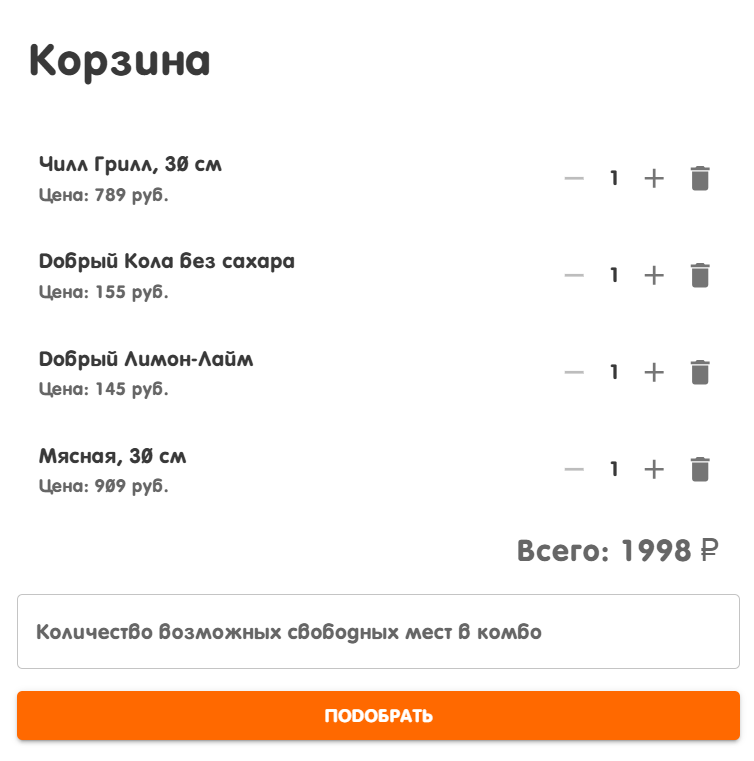  
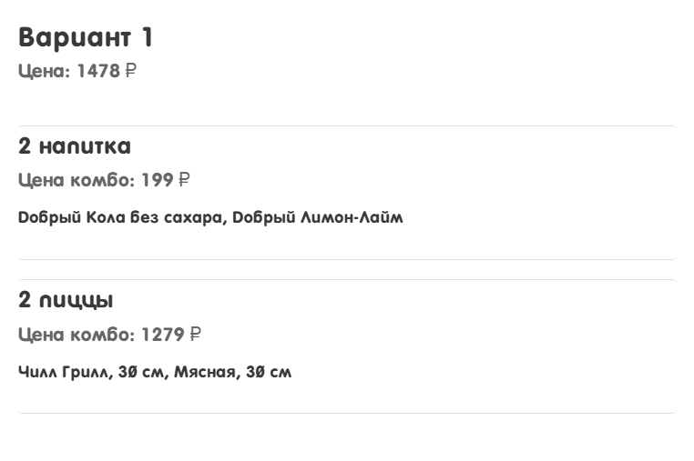 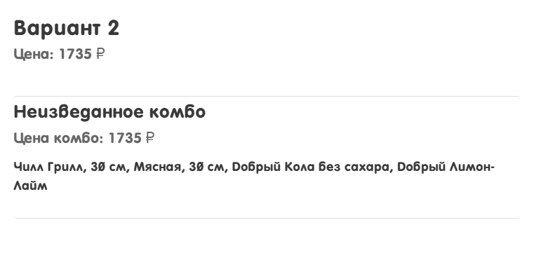  
Оказывается, что выгоднее распределить товары по двум разным комбо, чем включить в одно. Так, при заказе товаров по отдельности пришлось бы заплатить 789 + 909 + 155 + 145 = 1998 руб. Если бы мы выбрали "Неизведанное комбо, то заплатили бы 1735 руб (из них 80 это наценка). А во наиболее выгодным вариантом оказалось взять два комбо: 2 напитки и 2 пиццы за 1478 руб (из них 80 наценка).

### Пример 2

>Теперь сформируем заказ из 4 закусок и возьмем, например, только Додстер Чилл Грилл. Его базовая стоимость 239 руб. Без использования комбо пришлось бы заплатить 4*239 = 956 руб. Но естьотличный вариант состоящий из 4 закусок, базовая стоимость которого 759 руб., а доплата за одну такую позицию 10 руб. Соответственно за один такой заказ придется заплатить 799 руб. Но выполнив соответствующий запрос в программе получим другой вариант распределения:  
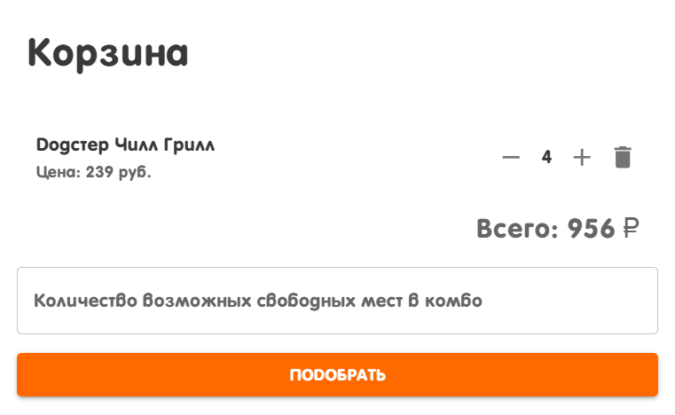  
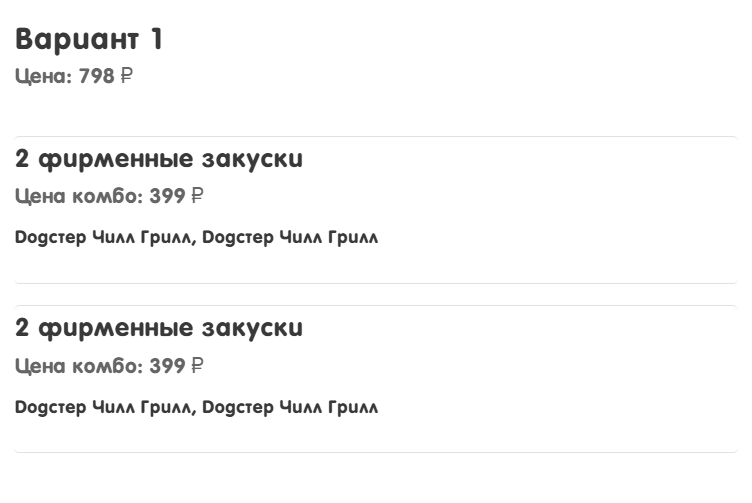 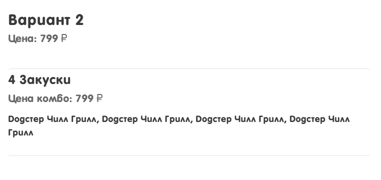  
На самом деле более выгодным вариантом получается распределение по 2 закуски в 2 комбо, базовая стоимость одно из которых 399 руб, а доплата за Додстер Чилл Грилл отсутствует. Таким образом мы экономим еще 1 руб.

## Состав команды
Бородин Михаил  
Рокин Олег  
Вычужанин Олег  
Жукова Екатерина
